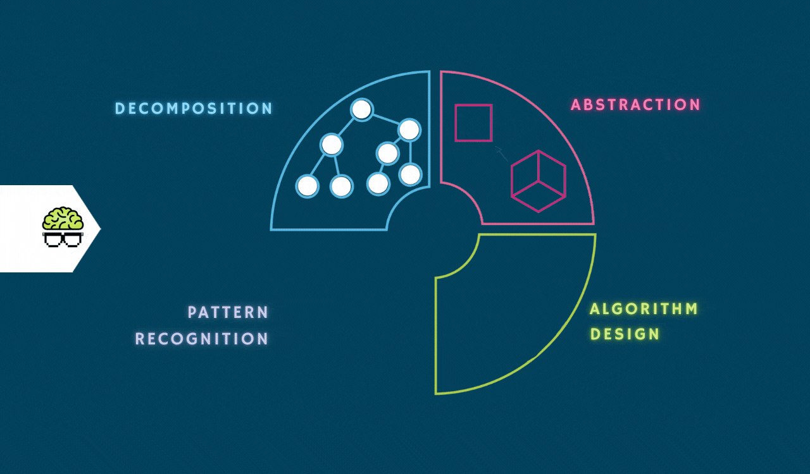

## Hey 👋, I'm Sam Cong!

I am currently a second-year UChicago MACSS student interested in **cognitive modeling** 🧠 to better understand mental processes among individuals with and without mental disorders. Broadly, I am interested in studing cognitive processes behind human **creativity** ✨ using state-of-art computational approaches (e.g., compositional stroke embedding models for drawing and NLP for say-out-loud narratives). Additionally, I am interested in utilizing reinforcement learning and sequential sampling models, as well as novel AI-based methods to better understand people's **decision-making processes** ⚖️ and further to advance **diagnostic and therapeutic methodologies** 🩺 through rigorous, data-driven approaches that extend beyond traditional psychological assessments.
 
 

  
### 🧐 More About Me:

- 💪 &nbsp; I’m currently preparing my application for the upcoming PhD application cycle; 
- 🤝 &nbsp; I’m more than welcome to collaborate on research projects related to creativity, decision-making, and computational psychiatry; 
- 🌱 &nbsp; I’m currently honing web development and deep learning skills; 
- 👨🏻‍💻 &nbsp; Most of my projects are available on [Github](https://github.com/cty20010831?tab=repositories); 
- 📫 &nbsp; Feel free to ping me on [LinkedIn](https://www.linkedin.com/in/tianyue-cong-94969921b/); 
- 📝 &nbsp; Checkout my [CV](assets/CV.pdf); 
- 📚 &nbsp; During my spare time, I enjoy 🎱, 🏀, and 📸.

 

### 🔨 Languages and Tools:

<!-- Programming Languages -->
#### 💻 Programming Languages

  
  
  
  
  
  
  

<!-- AI & ML -->
#### 🤖 AI & Machine Learning Tools

  
  
  
  
  

<!-- Data Science -->
#### 📊 Data Science Libraries

  
  
  
  
  

<!-- Big Data, High Performance Computing, and Cloud Computing -->
#### ☁️ Big Data, High Performance Computing, and Cloud Computing

  
  
  
  

<!-- Productivity -->
#### 📋 Productivity Tools

  
  
  
  
  
  

 

### 📊 GitHub Stats

<!-- Top Languages -->

<!-- GitHub Stats -->

&nbsp;

<!-- GitHub Streak -->

&nbsp;

 

### 🛠️ My Projects

